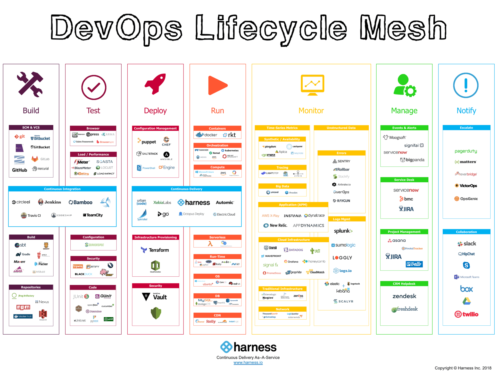

.left-column-50[

# Manage, configure and Operate

## Setting boundaries and respecting them

Ironically I did not ask!
]
.right-column-50[

]

.pull-left[

]

???

- There is no perfect right answer, so you have to be able to review, and reconfirm or ascertain a new requirement and change.
