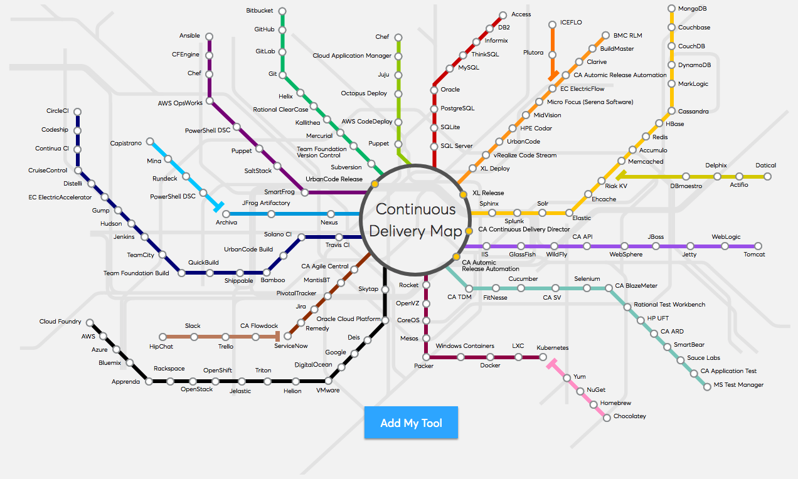

.left-column-50[

# Manage, configure and Operate

## Setting boundaries and respecting them

Ironically I did not ask!
]
.right-column-50[

]

.footer[

]

???

- Need to understand limitations, respect boundaries and how to work with tools, teams and responsibilities that cross boundaries
