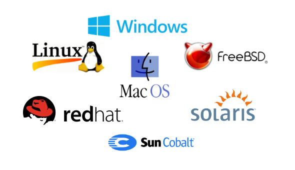
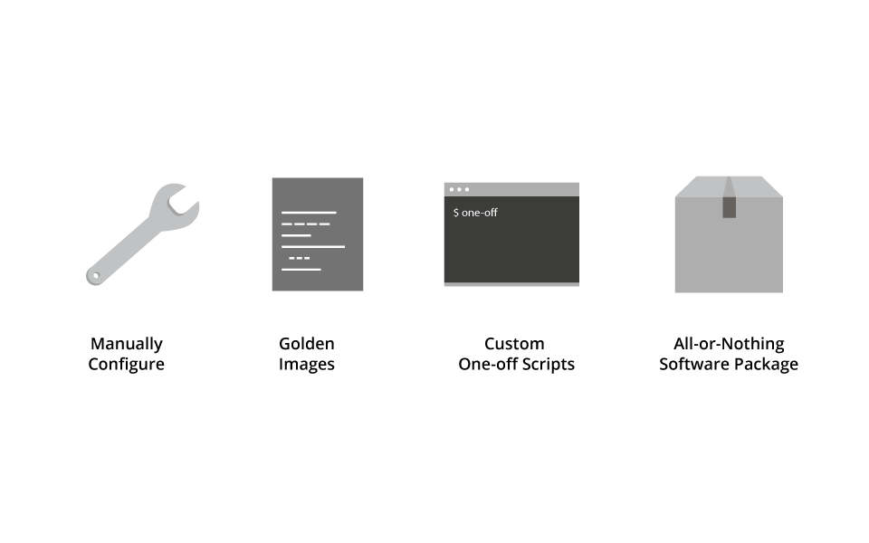
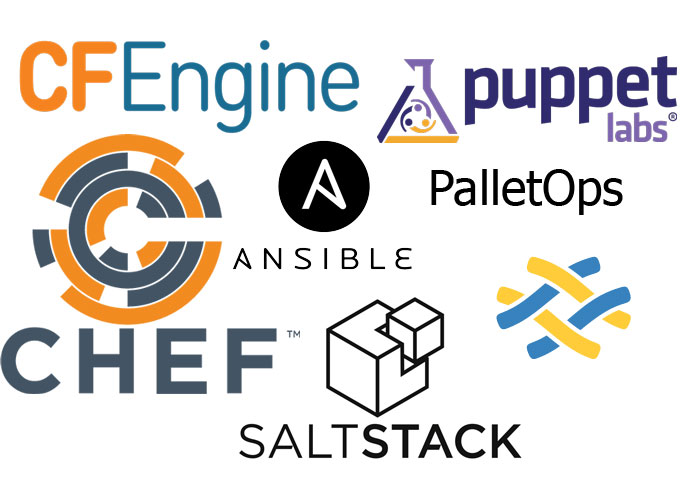

autoscale: true
footer: @digitaladept [http://abuxton.github.io]
slidenumbers: true

---
#Complimentary not Competitive!
##"Discussion of using seemingly competitive technology complimentarily!",

---

---
## Discussion of using seemingly competitive technology complimentarily!

---
# Inital Thoughts! #
## Lets see whose on what side of the room? ##

* Platform architecture.
* Operating systems.
* Programming languages.
* Design patterns.
* Methodology.
* Daddy or Chips?

---
# Seemingly Competitive Technology!

---

---

---

#Complimentary usage!
### It does not have to be one or the other!

---
# But we all need boundaries

###Relationships within organisations as well as between products and their implementations

---
#Building those relationships

So you want to use Docker in production, no lets not get dragged into that argument too. Lets consider what the statement infers you need to consider.

* A node to host the containers
* A deployment of Docker, maybe a container server too
* Firewall rules for the container server
* Moving the Docker configuration file to the server and initiating the build and managing the container.
* Monitoring all the things.

---
#Then who and what goes where!

* Provisioning the Docker container server, and the node. Provisioning or orchestration (VMware AWS, Azure, Openstack, cobbler, or Razor)
* Installing the container server, and Docker. configuration management.
* Firewall rules. Config management.
* Initiating Docker build and managing. Configuration management or orchestration.
* Monitoring, more provisioning and configuration management.

---
#From where I'm standing
 * Provision a server to be a Puppet master, and a management node.
 * Configure the management node with Puppet to talk to the cloud or virtualizations service of your choice.
 * Use puppet to provision nodes as Puppet master, Docker container server, and the platform servers.
 * Use a boot script to deploy the Puppet master in the cloud, and deploy Puppet on the platform servers.
 * Use Puppet to configure the Docker server, install and configure Docker on the platform nodes or maybe Kubernetes server and agent on the nodes.
 * Then the containers can be managed by what ever the container owners desire, driven by integration scripts or orchestration they choose.

---
#Look Mom no competition!

##Thats right, Puppet as a key technology but complimented.

**Puppet** features strongly in my stories, but so does  **AWS** or **vSphere**, **Ruby** or **Python** or **Shell scripts**, and **Rightscale** with **Cobbler**.

^ Recognising the boundaries of each product, communicating their sphere of responsibility with each party in a community or organisation and managing, monitoring and reacting to changes in that sphere. Complimentarily not Competitively!.

---
#How do you use this idea?
How do I start with Puppet is one of those questions we are asked every day!

* Recognise the boundaries of what you want to use Puppet for.
* Recognise what the users you want from Puppet and what their stake is.
* Recognise where the boundaries cross, so you know the hurdle you will have to overcome.

If you figure out how to do that first time, tell me how!

---
#Puppet promotes you to use Puppet this way.

* Abstraction of operating system default providers (yum, systemd, etc)
* Open, and documented API end points for intergration
* Documented extensions for intergation to third party systems.
* Transparent intergration to complimentary software **Facter**, and **MCollective**.
* intergration to standard systems,
^ Puppet do not make a package manager, a service manager or a version control system.

---
#Where do we start?

___
#Q&A?
##Thank you

---
#Credits
###We all 'borrow' pictures from somewhere!
