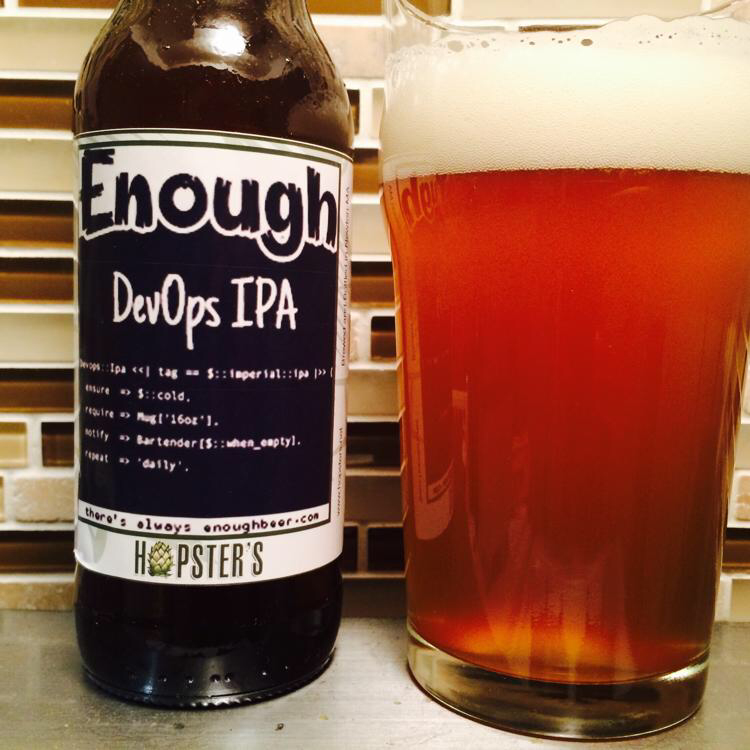
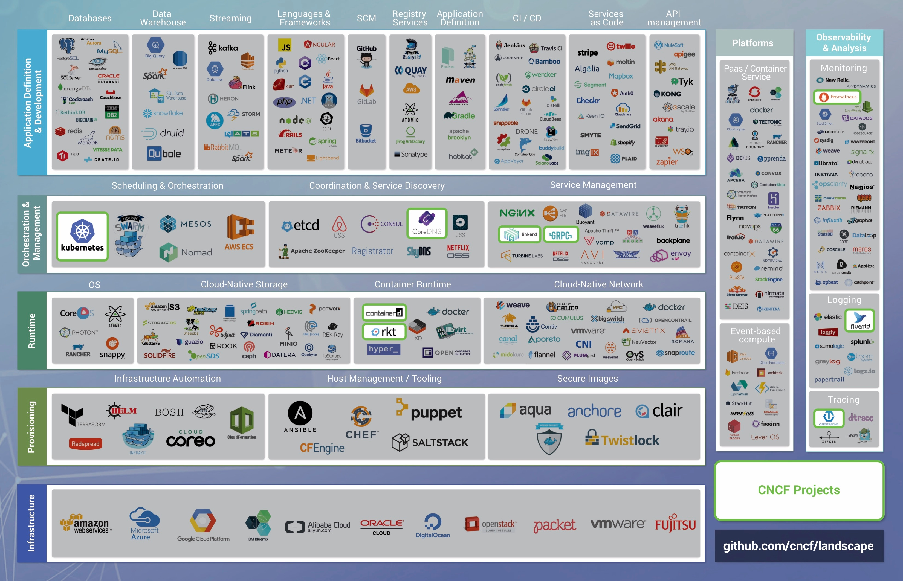
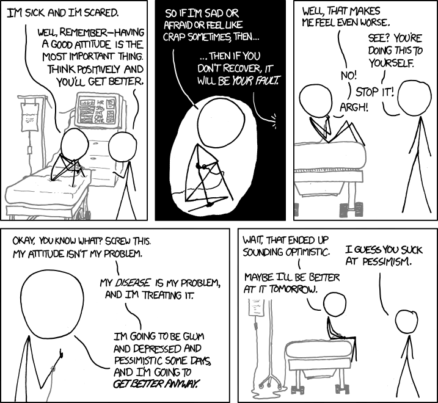

autoscale: true 
footer: @digitaladept [http://abuxton.github.io]
slidenumbers: true

# DevOps Distilled
### The Essance of DevOps! and no I don't mean sweat and toil.

---
# Introductions
A need to support my coffee addiction has taken me around the world working with and supporting all manner of development teams. The same addiction has supported me through long days and nights of platform integrations, fire fighting and launch management for various development teams in startups, gaming, finance and most fields of enterprise.

Feel free to buy me a coffee and ask my opinion on anything tech based, DevOps, or Comic book and Climbing.

---
# What is DevOps to you? 

It's a simple question but such a complex answer! 
* Recuiters think it's...
* Enterprise thinks it's... 
* Startups think it's.. 
* The dictionary says it's...

---

# How do you DevOps? 
* Impliment a siloed team?
* Try and change your companies
* Bring in transformation via consultants
* Utilize `All the THINGS!`
* another way. 

---

# So what is DevOps? 

Let me bring it back to real basics:
* Communication
* Responsibilities
* Capabilities

---

# Favourite DevOps tool

### What if I told you Email, news groups and Chat clients?

* They are the core of communication
* They provide history of where you stated capabilities of your team, tools or products. 
* They provide similar history of responsibility for capabilities, and enablement or denial and refusal.

---

# Did I speak in the negative

### Denial and refusal are not negative things!

---
# How does distilling it help?

* Simplify how and where to start adoption.
* Simplify how you look at the ridiculous breath of tools.
* Simplify how you review where your organization stands today.

Stop caring if you and your organisation are Agile, ITIL, old or new, enterprise of startup. 

--- 
# Q&A?

## Thank you

---
# Credits
### We all 'borrow' pictures from somewhere!

* https://xkcd.com/828/
* https://my.usgs.gov/confluence/pages/viewpage.action?pageId=571578175

