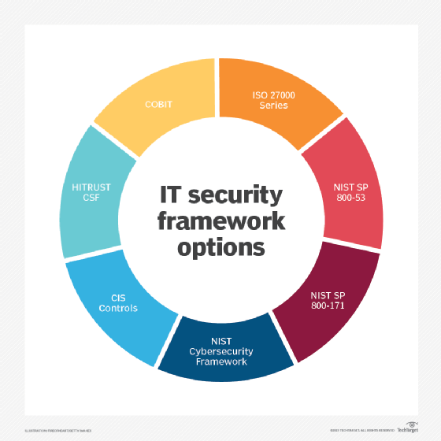
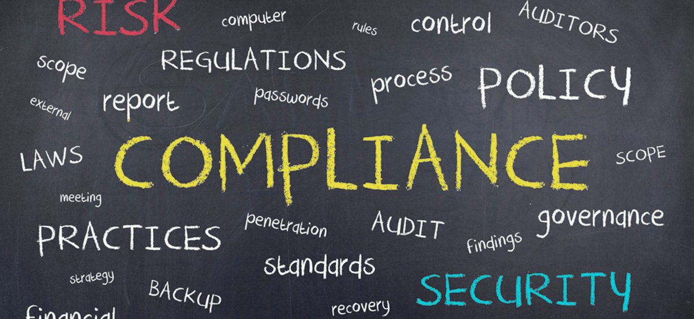
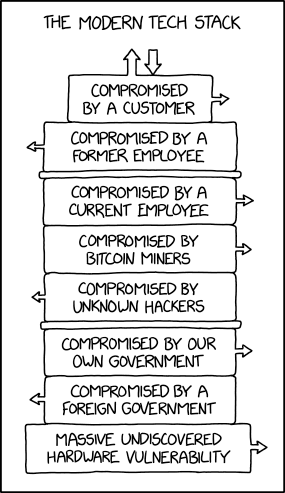

autoscale: true 
footer: @digitaladept [http://abuxton.github.io]
slidenumbers: true

# Automating, Configuring and Managing Security
 

---
# Introductions

A need to support my coffee addiction has taken me around the world working with and supporting all manner of development teams. The same addiction has supported me through long days and nights of platform integrations, fire fighting and launch management for various development teams in startups, gaming, finance and most fields of enterprise.

Feel free to buy me a coffee and ask my opinion on anything tech based, DevOps, or Comic book and Climbing.

---

# Standards, Benchmarks and more...
### Commonality of approach is important to recognise. 

* What or who are asserting the standard you comply to
* What provides the *Capability* to test for *Compliance*, *Remediate* or implement *Assurance*
* How to manage exceptions, expectation and take *Responsibility*.
* How to report or *Communicate* these elements.

---

# State of the Union

How do you work out were you pass and were you currently fail?

* Inventory tools such as Facter, Ohai.
* Adhoc scripts and reports with utilities such as Bolt or Ansible.
* Scanning applications such as Nessus
* Partial coverage from infrastructure tools such as Satelite

---
# Remediation and Assurance

* Adhoc Remediation with adhoc user driven actions, Scripts, or orchestration tools such as Puppet Bolt Task and Plans.
* Long term initial remediation with image management, template development or containerization.
* Assurance with automation or configuration management such as Salt, SCCM, or Puppet.
* How do we communicate exceptions.

---

# Communication and reporting

* Report the State of the Union
* Report remediation 
* Report assurance
* Business analysis on both.
  

---
# How does this tie into Puppet?

* Facter, Inventory service PQL, or Bolt tasks for inventory and discovery.
* Bolt or Puppet for remediation. 
* Puppet for assurance
* Console, Remdiate and Impact Analysis for reporting, or Bolt Apply Plans and Bolt reports.

---
# Q&A?
## Thank you

---
# Credits
### We all 'borrow' pictures from somewhere!

* https://xkcd.com/2166/
* https://www.optimisingit.co.uk/information-security-standards/
* https://cybersecurityreviews.net/2019/06/03/top-7-it-security-frameworks-and-standards-explained/
* https://www.marc.org/Government/Cybersecurity/Regional-Framework/Standards
