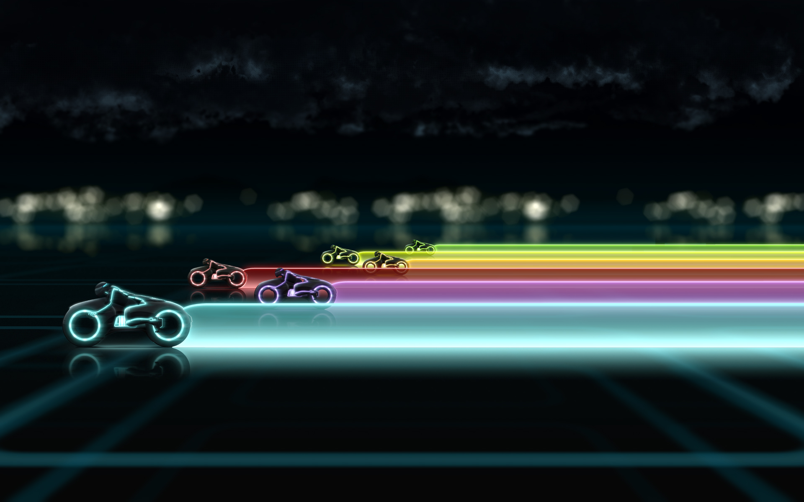

.left-column-50[

# Day 2 operations

* Ansible, Chef, Puppet, Salt ...
* Autoscaling configuration
* UI driven change process
* People driven change

]
.right-column-50[

Who can resist an excuse to use a Tron bike to illustrate DRIFT!
]

.footer[
> In the middle we have those things that cause change whether prescriptive or adhoc.
]

???

-
